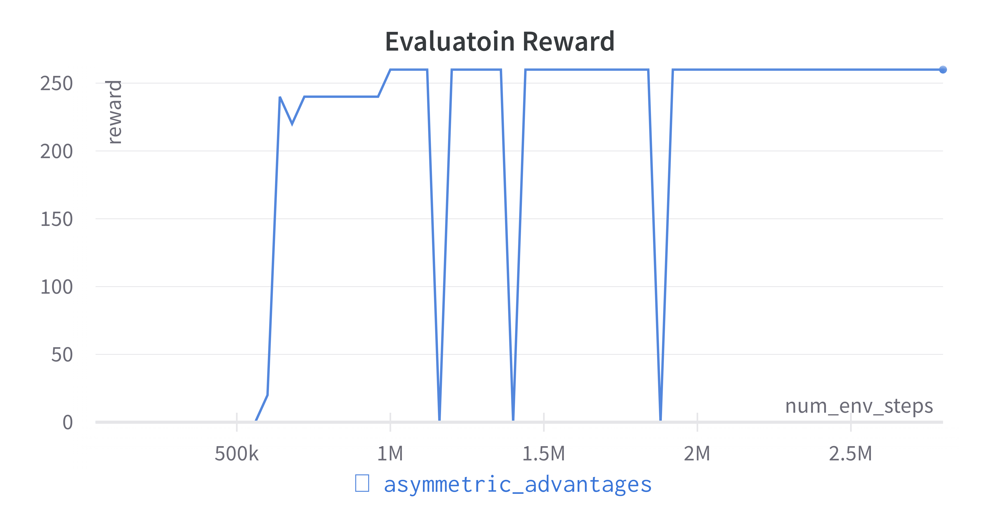
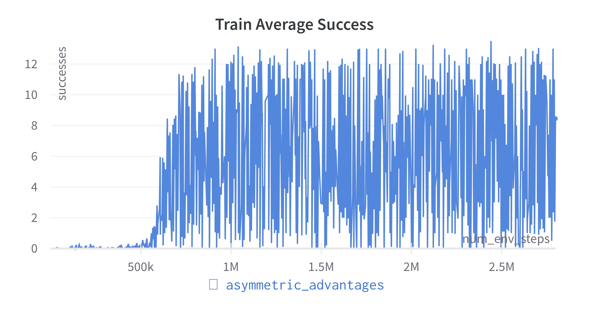
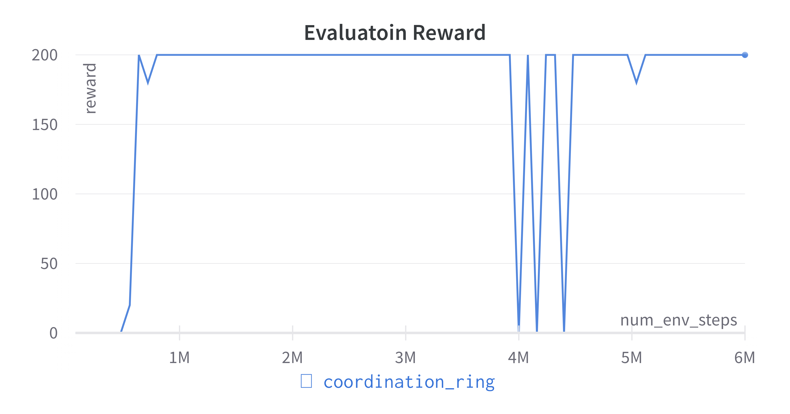
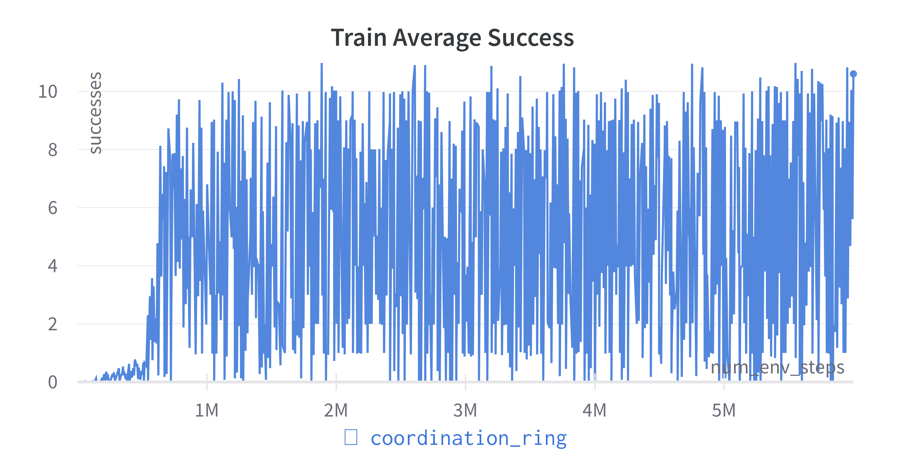
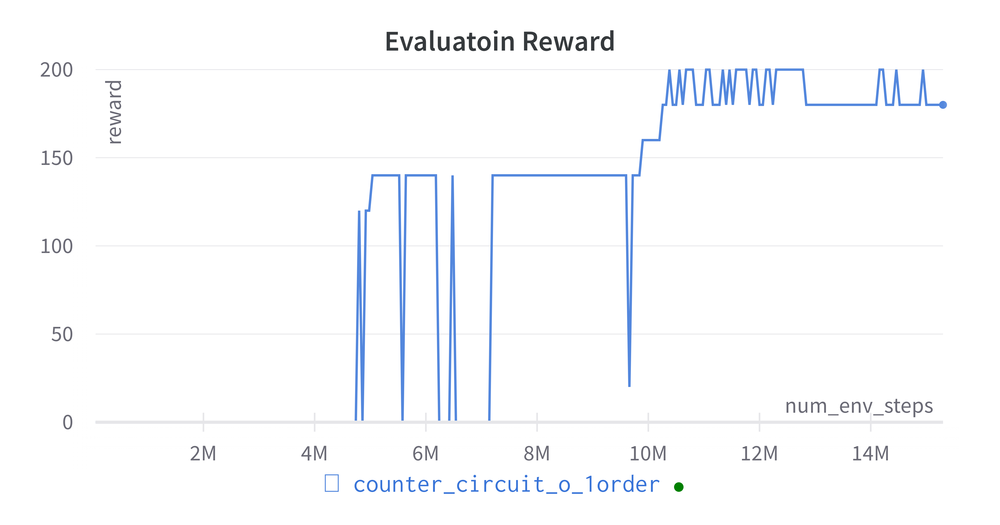
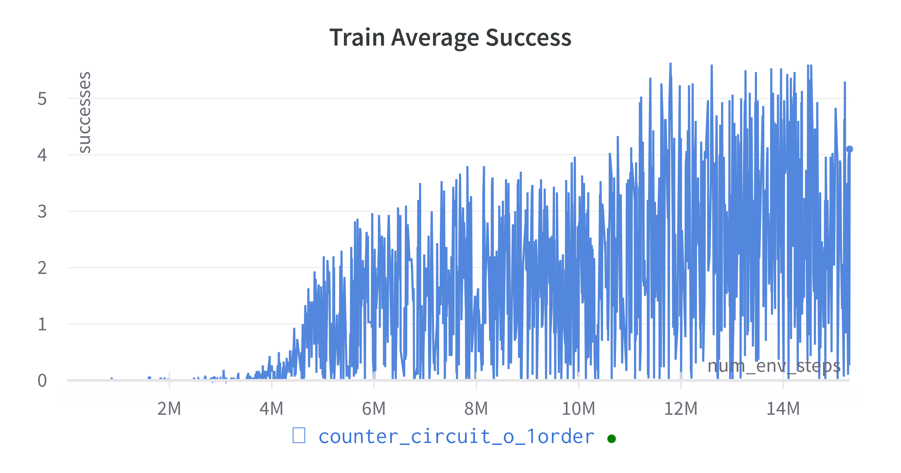
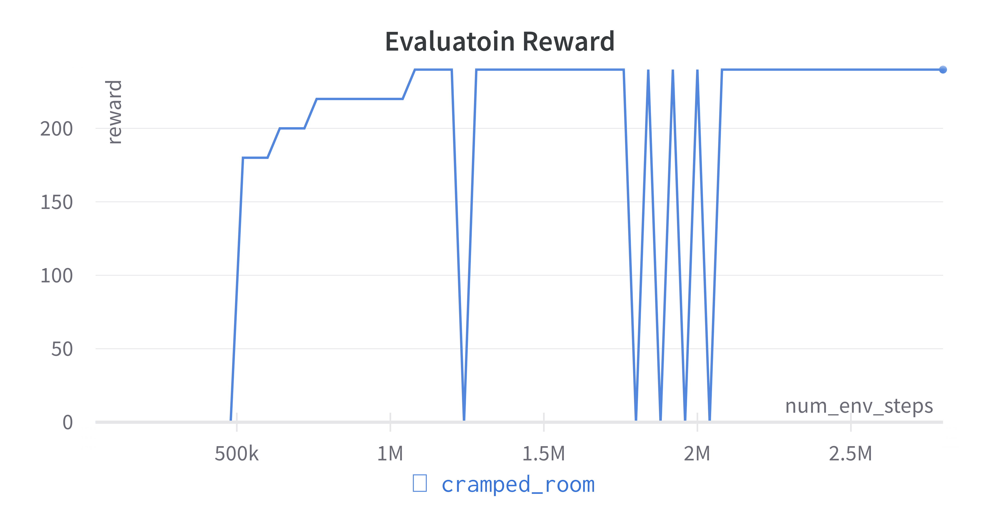
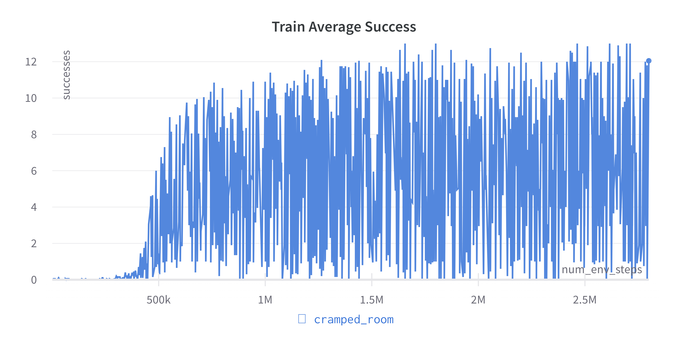
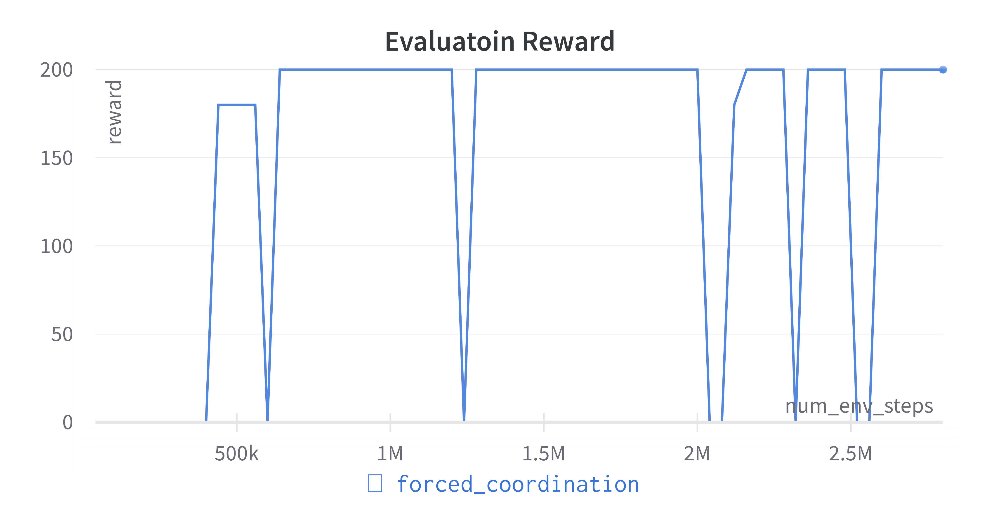
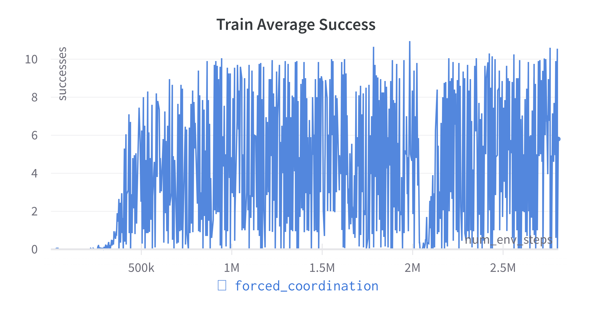

# MAPPO Project Report

## Result

In this project, I modify the interface of overcooked environment and implement the runner for overcooked environment in order to use the mappo library. I trained the agent on five scenarios, all with $400$ time steps, with shared policy network for agents. I record two curves: the first one is average number of successes among rollouts during training, the other is the number of successes in evaluation. 

|  |  |
|:---------------------:|:---------------------:|
|  |  |
|  |  |
|  |  |
|  | |

As we can see, in all scenarios, the agents can achieve $200$ rewards during evaluation, which means successfully sending $10$ soups.

## Details

I modify the interface of `overcooked_ai_py.mdp.overcooked_env.Overcooked` to make it suitable for the `mappo` library. I implemented the `OvercookedRunner` class and write the training script. To reproduce the result, first install dependencies as described in the `overcooked` and `mappo` repo. Then, run scripts inside `./on-policy/onpolicy/scripts/train_overcooked_scripts/`

## PPO Algorithm

I have written [a blog about PPO](policy_gradient_and_PPO.pdf) during the course *Introduction to AI* instructed by Prof Yi Wu. 

## Key Hyperparameters

+ `ppo_epoch`: number of epoches in one round of PPO optimization.
+ `clip_param`: $\epsilon$  inside $\mathrm{clip}(r_{t}(\theta), 1-\epsilon, 1+\epsilon)$, which prevents large policy update.
+ `num_mini_batch`: number of mini batches for PPO.
+ `entropy_coef`: weight for entropy bonus in the loss function that encourages exploration.
+ `gamma`: ordinary discount factor for reward in the markov decision problem. 
+ `value_loss_coef`: weight for value function error in the loss function.
+ `gae_lambda`
+ `huber_delta`: the parameter $\delta$ in huber loss, which makes training less sensitive to outliers in data than squared error loss.

# Problem and Discussion

I found that it is extremely inefficient for agent to learn from scratch, as is the case in this project. I may take the agent a long time to discover actions that can yield great rewards. Once the agent found such actions, the learning becomes fast. So I think it may be better to pretrain agents on human behaviour and then do PPO training.

